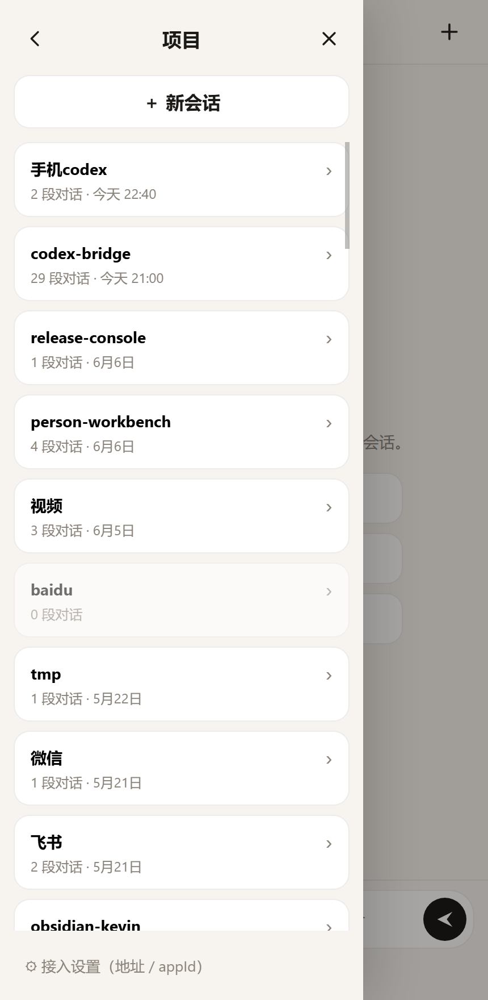
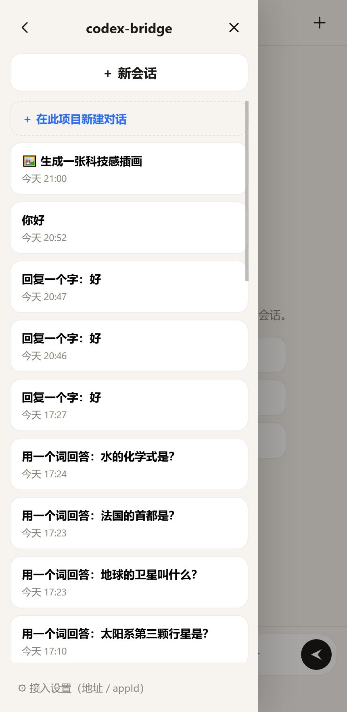
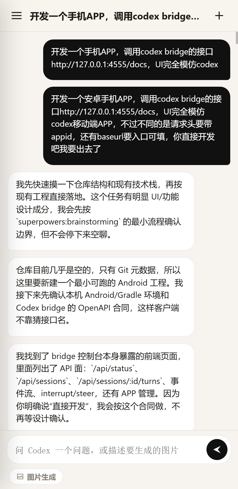
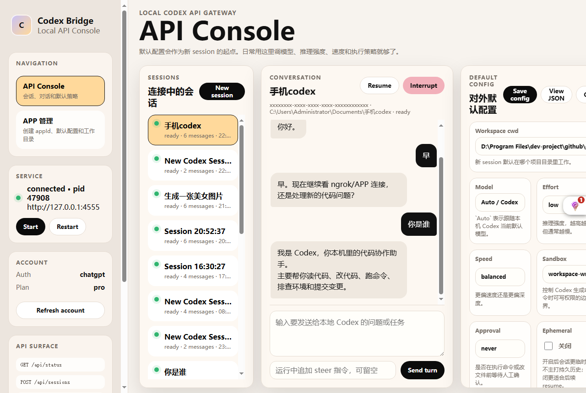

# Codex Bridge

> 把本机 `codex app-server` 包成一个本地 HTTP/SSE API + 可观测控制台，并自带一个**手机端 Codex Chat**：
> 在手机上浏览本机所有 Codex 项目与历史对话，点进任意一条接着聊。

默认监听 `http://127.0.0.1:4555`。

## ✨ 功能特性

- **本地 API 网关**：把 `codex app-server` 封装成稳定的 HTTP/SSE 接口，第三方应用调 HTTP 即可，不必直接对接 app-server。
- **可观测控制台** `/`：实时查看会话、事件流、token 用量、审批请求。
- **手机端 Codex Chat** `/m/`：流式对话、图片生成、连接波动提示，PWA 可加到主屏当 App 用。
- **📱 项目 / 历史浏览（新）**：读本机 `~/.codex` 的原生历史，按「项目 → 历史对话」两级列出你用过的全部 Codex 对话，点进任意一条**在该项目真实目录里接着聊**。
- **多 App 隔离 + appId 鉴权**：每个 `appId` 有独立工作区，只能访问自己的会话；本机回环直接放行管理端。
- **公网接入**：内置 Cloudflare Tunnel 一键脚本，配合 appId 密钥对外开放。

## 界面预览

手机端 Codex Chat —— 项目列表 · 历史对话 · 进入续聊：

| 项目列表 | 某项目的历史对话 | 进入对话续聊 |
| --- | --- | --- |
|  |  |  |

本地 API 控制台 `/`：



> 截图中的 appId 已做掩码处理，仅作展示。

## 快速开始

### 前置条件

- **Node.js ≥ 22**
- **已安装并登录 Codex CLI**：

  ```powershell
  codex --version
  codex            # 首次需登录
  ```

### 安装与启动

```powershell
git clone https://github.com/413162826/codex-bridge.git
cd codex-bridge
npm install
npm start
```

### 三个入口

```text
控制台    http://127.0.0.1:4555/
手机端    http://127.0.0.1:4555/m/index.html
Swagger   http://127.0.0.1:4555/docs   (openapi: /api/openapi.json)
```

Android 原生壳与构建脚本在 `android/`（`android/scripts/build-apk.ps1`），APK 也可从 `http://127.0.0.1:4555/codex-bridge.apk` 取。

## 📱 手机端 Codex Chat

打开 `http://127.0.0.1:4555/m/index.html`（iOS Safari / Android Chrome 可「添加到主屏幕」当 PWA）。

- **接入设置**（抽屉底部 ⚙）：
  - *Bridge 地址*：本机直连留空即可；走公网域名时填 `https://你的域名`。
  - *App ID*：手机经公网进来**必须**填一个已注册的 `appId`；本机 `127.0.0.1` 直连可留空。
- **项目 / 历史浏览**：点左上角菜单 → 看到**项目列表** → 点项目 → 该项目下的**历史对话** → 点任意一条载入记录，发消息即在该项目真实目录里继续。
- **在此项目新建对话**：项目内点「＋ 在此项目新建对话」，新会话直接落在该项目目录。
- **图片生成**：输入描述后点「图片生成」，生成的图片直接在对话里内联返回。

### 历史数据从哪来

项目与历史对话直接读**运行 Bridge 这台机器**的 `~/.codex`（或 `CODEX_HOME`）：

- 对话本体：`~/.codex/sessions/**/rollout-*.jsonl`（任何 Codex CLI/桌面端用法都会写）。
- 项目命名与顺序：`~/.codex/.codex-global-state.json` 的 `project-order` / `electron-saved-workspace-roots`（由 **Codex 桌面端** 写）。只用纯 CLI、没装桌面端时，会回退成「按对话的工作目录(cwd)自动聚合，名字取文件夹名」。

这是「本机自省」：谁在跑 Bridge，就照出谁的 Codex 历史，不跨机器、不跨用户。任何人 clone 本仓库在自己机器上跑，看到的都是他自己的项目与会话。

> ⚠️ **安全**：把项目/历史浏览经公网 + appId 暴露出去，意味着**持有该 appId 的人能读你全部 Codex 历史、并在真实目录续聊（可读写项目文件）**。请妥善保管 appId，不要把它提交进仓库或泄露。

## 配置文件 `bridge.config.json`

仓库根目录的 `bridge.config.json` 是随项目提交的静态配置，启动必读。外部鉴权写在这里：

```json
{
  "server": { "host": "127.0.0.1", "port": 4555 },
  "security": { "requireAuth": true, "allowAppIdKeys": true, "trustProxy": false, "allowedIps": [], "adminKeys": [] }
}
```

优先级：**环境变量 > `bridge.config.json` > 内置默认**。`requireAuth` 默认开启；只有临时关掉本机鉴权调试时才用 `$env:CODEX_BRIDGE_REQUIRE_AUTH="0"`。

## 常用环境变量

```powershell
$env:CODEX_BRIDGE_PORT=4555
$env:CODEX_BRIDGE_HOST="127.0.0.1"
$env:CODEX_BRIDGE_CWD="D:\path\to\your\project"   # 新会话默认工作目录
$env:CODEX_BRIDGE_MODEL=""
$env:CODEX_BRIDGE_EFFORT="low"
$env:CODEX_BRIDGE_SANDBOX="workspace-write"
$env:CODEX_BRIDGE_APPROVAL_POLICY="never"
$env:CODEX_HOME="C:\Users\you\.codex"             # 历史读取的 Codex 目录（默认 ~/.codex）
npm start
```

## 外部鉴权与白名单

外部鉴权默认开启，直接 `npm start` 即可。访问控制规则：

- 本机 `127.0.0.1` 始终作为管理端放行，方便在电脑上创建/管理 `appId`。
- 外部请求用已注册 `appId` 作访问密钥：`Authorization: Bearer <appId>` 或 `X-Codex-App-Id: <appId>`。
- `appId` 密钥只能访问自己的 session、读项目/历史、续聊；不能远程创建新 appId 或管理其他 app。
- 管理级白名单可用 `CODEX_BRIDGE_ALLOWED_IPS` 或 `CODEX_BRIDGE_ADMIN_KEYS`：

  ```powershell
  $env:CODEX_BRIDGE_ALLOWED_IPS="203.0.113.8,10.10.0.0/21"
  $env:CODEX_BRIDGE_ADMIN_KEYS="change-me-admin-key"
  ```

- 放在反向代理 / Cloudflare Tunnel / frp 后面、要按真实客户端 IP 做白名单时，再开 `$env:CODEX_BRIDGE_TRUST_PROXY="1"`。

公网场景不建议裸 HTTP 直连，优先走 VPN、Tailscale/ZeroTier、HTTPS 反代或隧道。

## 公网接入：Cloudflare Tunnel

`host` 保持 `127.0.0.1`（隧道 agent 在本机连回环，公网碰不到局域网最安全）。一键脚本：

```powershell
# 前置：域名已托管到 Cloudflare，且 cloudflared tunnel login 完成授权
.\scripts\setup-cloudflare-tunnel.ps1 -Hostname bridge.example.com
# 测通后，管理员 PowerShell 装成开机自启服务：
.\scripts\setup-cloudflare-tunnel.ps1 -Hostname bridge.example.com -InstallService
```

只有局域网内手机要直连时，才把 `server.host` 改成 `0.0.0.0`。

## API 参考

```text
GET  /api/health
GET  /api/status
GET  /api/config            PUT /api/config
GET  /api/openapi.json
POST /api/codex/start       POST /api/codex/restart
GET  /api/events
GET  /api/models            GET /api/account            GET /api/rate-limits
GET  /api/apps              POST /api/apps
GET  /api/apps/:id          PUT /api/apps/:id           DELETE /api/apps/:id
POST /api/uploads/images

# 会话
GET  /api/sessions          POST /api/sessions
GET  /api/sessions/:id      POST /api/sessions/:id/resume
GET  /api/sessions/:id/events
GET  /api/sessions/:id/files?path=<local-path>
POST /api/sessions/:id/turns            (?wait=1 同步 / ?stream=1 流式)
POST /api/sessions/:id/interrupt        POST /api/sessions/:id/steer
POST /api/sessions/:id/archive

# 项目 / 历史（读本机 ~/.codex）
GET  /api/projects                      # 项目列表
GET  /api/projects/:id/threads          # 某项目的历史对话
GET  /api/threads/:id                   # 单条对话的完整文字记录
POST /api/threads/:id/resume            # 用 rollout id 恢复该对话、登记进会话以便续聊

# 高级流式（推荐第三方接入）
POST /api/chat                          # 建会话 + 发首轮 + 流式返回，一个请求搞定
```

### 创建 appId

```powershell
Invoke-RestMethod http://127.0.0.1:4555/api/apps -Method Post `
  -ContentType "application/json" -Body '{"name":"my-app"}'
```

会生成 `appId(UUID)`、创建 `workspaces/<appId>` 目录、复制当前全局默认配置作为该 app 初始配置。

### 高级流式接口

为第三方提供「一次调用即流式输出」，响应是 `text/event-stream`，用 POST 承载（隧道下实时、且能带鉴权头）。

- `POST /api/chat` —— 建会话 + 发第一轮 + 流式返回。
- `POST /api/sessions/:id/turns?stream=1` —— 已有会话发后续轮，只流式返回这一轮。

事件按 `event:` 名区分：

```text
event: session  {sessionId, threadId, model, created}        首帧，拿到会话 id 供后续复用
event: delta    {turnId, delta, seq}                         逐字增量
event: image    {turnId, url, mimeType, byteSize, dataUrl?}  生成图片（≤256KB 内联 base64，否则给 url）
event: usage    {turnId, tokenUsage}
event: done     {turnId, status, finalText}                  终止帧
event: error    {code, message}
event: ping     {t}                                          15s 心跳
```

例（本机免鉴权；走域名时加 `-H "Authorization: Bearer <appId>"`）：

```bash
curl -N -X POST http://127.0.0.1:4555/api/chat \
  -H "content-type: application/json" \
  -d '{"text":"用一句话解释快速排序"}'
```

多轮：用首帧返回的 `sessionId`，对 `POST /api/sessions/<id>/turns?stream=1` 继续发即可。客户端断开会自动打断该轮（省 token）。

## 测试

```powershell
npm test               # 单元测试（access-control / session-store / codex-history 等）
npm run smoke          # 本机 smoke
npm run smoke:android  # 手机端依赖的 Bridge API smoke（appId、图片上传、会话连续两轮等）
```

## 目录结构

```text
src/                后端：HTTP/SSE 服务、鉴权、会话、原生历史读取
  server.js         路由与流式
  codexHistory.js   读 ~/.codex 的项目与历史对话（/api/projects /api/threads）
  accessControl.js  appId / IP / admin key 鉴权
  sessionStore.js   会话与事件
public/             控制台与手机端
  index.html        本地 API 控制台
  m/                手机端 Codex Chat（PWA）
android/            Android 原生壳与构建脚本
scripts/            smoke / 探针 / Cloudflare 隧道安装
docs/screenshots/   README 截图
```

## 设计边界

面向**本机 + 隧道**接入：

- 默认强制外部鉴权（`requireAuth: true`），校验 IP 白名单 / admin key / 已注册 `appId`；本机回环放行管理端。
- 经隧道转发（带 `X-Forwarded-For`）的回环请求不再当本机放行，必须带 `appId`。
- 默认只监听 `127.0.0.1`，CORS 默认开（方便本机调试），不建议直接裸暴露公网。
- 真正给其他项目用时，建议外部应用调本 Bridge 的 HTTP/SSE API，而不是直接连 `codex app-server`。
